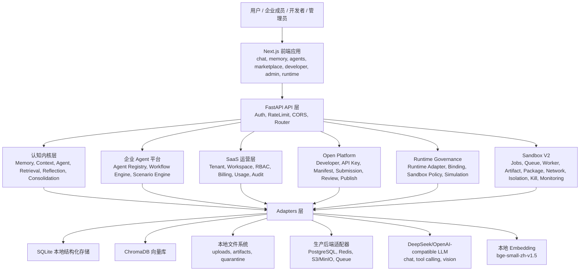
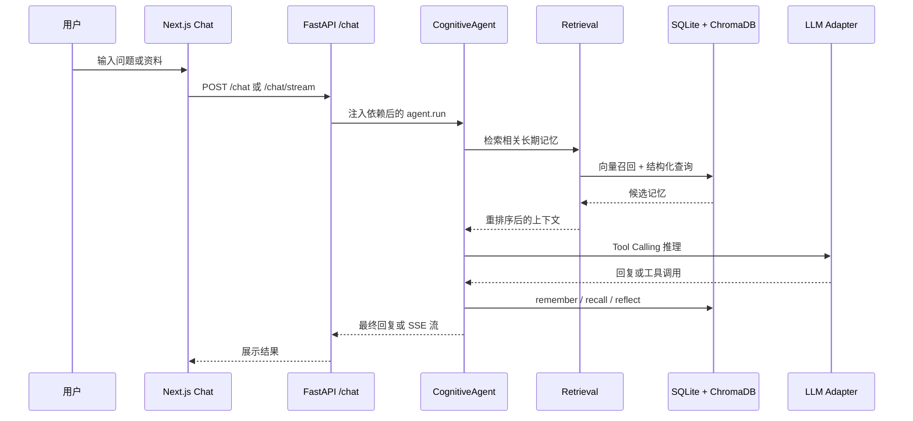
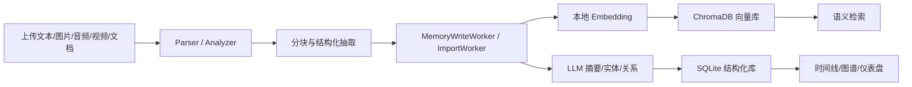
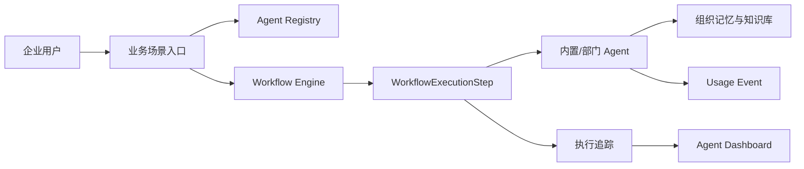
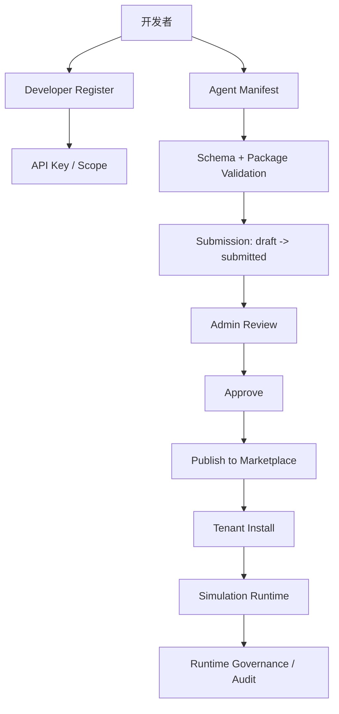
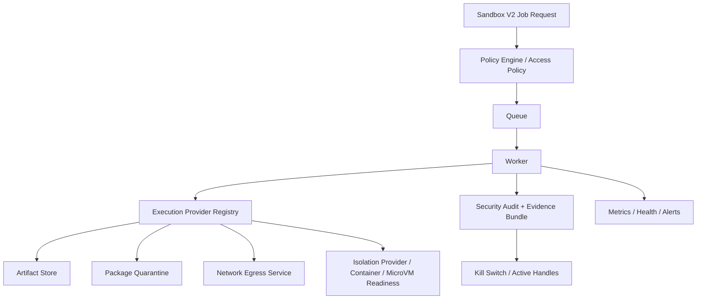

# 黔智脑 Cognitive OS 架构说明

版本：2026-06-13  
范围：`D:\dma\day2` 当前项目架构、模块边界、关键链路、安全治理、部署演进  
定位：面向项目计划书、商业计划书、演示 PPT 和技术答辩的正式架构材料

---

## 1. 架构总览

黔智脑 Cognitive OS 不是单一聊天机器人，而是以“个人和组织的第二大脑”为核心目标的 AI 认知操作系统。系统底层以记忆、检索、反思和知识巩固构成认知内核，上层扩展出企业级 Agent 平台、Agent Marketplace、Open Platform、Runtime Governance 和 Sandbox V2 安全治理体系，形成从个人知识管理到企业智能体生态的完整架构。

当前项目已经具备五个清晰层次：

1. 认知内核层：负责记忆建模、上下文构建、语义检索、反思、知识巩固、多模态导入。
2. 企业 Agent 层：负责内置 Agent、部门 Agent、工作流、业务场景和执行追踪。
3. 开放平台层：负责开发者注册、API Key、Manifest、提交审核、发布到 Marketplace。
4. Runtime 与 Sandbox 治理层：负责运行时绑定、安全策略、模拟执行、禁用式执行闸门、Sandbox V2 作业、队列、工件、包隔离、网络、隔离能力、Kill Switch、监控和审计。
5. SaaS 与运营层：负责租户、工作区、RBAC、订阅、用量、计费、增长、审计、合规和生产后端迁移路径。

核心架构结论：系统采用六边形架构思想，领域模型与外部 I/O 隔离；采用 Manifest-first 和 deny-by-default 的安全原则，将“可安装、可审核、可模拟、可治理”与“真实执行第三方代码”明确分离；本地演示模式可运行，生产化能力以配置、适配器和 readiness 方式逐步演进。

---

## 2. 总体架构图



---

## 3. 架构原则

### 3.1 Cognitive OS 优先

项目的技术目标不是“问答窗口”，而是让 AI 持续形成用户和组织的认知模型。每个模块都围绕记忆、语义检索、知识关系、反思和行动闭环设计。

### 3.2 六边形架构隔离

代码组织遵循 Ports & Adapters：

| 层级 | 主要目录 | 职责 |
|---|---|---|
| 领域核心 | `src/core/`、`src/open_platform/`、`src/agents/` | 定义业务模型、状态机、策略、服务流程，不直接绑定具体基础设施 |
| 适配器 | `src/adapters/` | 封装 SQLite、ChromaDB、本地文件、生产后端、缓存、队列等外部 I/O |
| API | `src/api/` | 请求解析、鉴权入口、响应格式化、路由聚合 |
| 前端 | `frontend/app/`、`frontend/components/`、`frontend/services/` | 业务页面、管理台、开发者台、Marketplace、Runtime Admin |
| 入口组装 | `main.py` | 统一初始化配置、服务、store、worker、router 和依赖注入 |

### 3.3 安全默认关闭

Open Platform 和 Runtime/Sandbox 设计坚持：

- 第三方 Agent 先以 Manifest 形式进入系统。
- 发布、安装、模拟和执行是不同阶段，不能混同。
- Simulation Runtime 只做确定性模拟，不执行 `package_url` 和 `entrypoint`。
- Runtime Execution Gate、Production Sandbox Gate、Package Download Worker、Artifact Materialization 默认关闭或 fail closed。
- Sandbox V2 的容器和 MicroVM 能力通过 readiness、preflight、trusted fixture 和策略门控推进，不能被文档描述为“已经具备生产级任意代码执行”。

---

## 4. 分层架构说明

### 4.1 前端表现层

前端位于 `frontend/`，技术栈为 Next.js 15、React 19、TypeScript、Tailwind CSS、Zustand、TanStack Query、Recharts、Vis Network 和 lucide-react。页面采用 App Router 组织，覆盖：

- 个人认知：`/chat`、`/memory`、`/timeline`、`/graph`、`/reflection`、`/audio`、`/video`、`/sync`。
- 企业 Agent：`/agents`、`/agents/scenarios`、`/agents/workflows`、`/agents/executions`。
- Marketplace：`/agent-marketplace`、`/agent-marketplace/installations`。
- 开发者平台：`/developer`、`/developer/register`、`/developer/api-keys`、`/developer/agents`。
- 管理后台：`/admin`、`/admin/agent-submissions`、`/admin/runtime`、`/admin/audit`、`/admin/policy`、`/admin/deployment`。
- SaaS 运营：`/account`、`/billing`、`/pricing`、`/workspace`、`/analytics`。

前端服务层通过 `frontend/services/` 封装 API 客户端，`next.config.js` 提供同源代理 rewrite，使部署时既可以直连 FastAPI，也可以通过 `/api/*` 转发。

### 4.2 API 接入层

后端入口为 `main.py`，基于 FastAPI。中间件链包含 AuthMiddleware、CORS 和 RateLimitMiddleware。API 层将系统拆分为多个 router，主要端点族包括：

| 端点族 | 作用 |
|---|---|
| `/chat`、`/chat/stream` | 核心对话与流式输出 |
| `/memory`、`/memory/search`、`/reflection`、`/tools` | 记忆、检索、反思、工具管理 |
| `/dashboard`、`/timeline`、`/graph` | 认知可视化和知识图谱 |
| `/upload`、`/audio`、`/video`、`/imports`、`/sync` | 多模态上传、批量导入、外部知识源同步 |
| `/agents` | 企业 Agent、工作流、场景执行 |
| `/agent-marketplace` | Agent Marketplace 浏览、安装、配置、分析 |
| `/developers` | 开发者注册、API Key、Agent Submission、Manifest 校验、模拟 |
| `/admin/agent-submissions` | 管理员审核、包校验、发布 |
| `/admin/runtime`、`/admin/sandbox-policies` | Runtime Adapter、Binding、Sandbox Policy、治理摘要 |
| `/api/runtime/sandbox-v2` | Sandbox V2 作业、队列、工件、包隔离、网络、隔离、Kill、监控、安全审计 |
| `/subscription`、`/usage`、`/billing`、`/tenants`、`/api/tenant` | SaaS 订阅、用量、计费、租户和配额 |
| `/api/admin`、`/api/audit`、`/api/compliance` | 管理、审计、合规和生产后端 readiness |

### 4.3 认知内核层

认知内核主要在 `src/core/` 和 `src/tools/` 中实现。关键模块包括：

| 模块 | 职责 |
|---|---|
| `agent.py` | CognitiveAgent 核心循环，负责 Tool Calling、上下文推理和反思闭环 |
| `context.py` | Context Builder，只注入系统提示、近期对话、相关长期记忆和当前输入 |
| `memory.py`、`types.py` | MemoryStore、VectorStore、LLMProvider 等协议和 Memory 数据模型 |
| `retrieval.py` | 语义召回、重排序、时间衰减和重要性加权 |
| `consolidation.py`、`memory_lifecycle.py` | 记忆巩固、重要性评分、生命周期管理 |
| `image_analyzer.py`、`audio_analyzer.py`、`video_analyzer.py` | 图片、音频、视频内容分析 |
| `import_pipeline.py`、`import_worker.py` | 文档导入、分块、写入、失败恢复 |
| `remember.py`、`recall.py`、`reflect.py`、`registry.py` | Agent 可调用工具与 SAFE/DANGEROUS 权限分层 |

记忆系统采用 SQLite 与 ChromaDB 双写：SQLite 保存结构化字段、实体、时间线和业务状态；ChromaDB 保存语义向量；Embedding 使用本地中文模型；LLM 通过兼容 OpenAI Tool Calling 的适配器接入。

### 4.4 企业 Agent 层

企业 Agent 能力集中在 `src/agents/`。系统内置知识、会议、研究、销售、客服、培训等 Agent，并提供：

- Agent Registry：注册、启用、禁用、配置。
- Workflow Engine：多节点流程编排，支持会议转培训、研究转报告等预设工作流。
- Scenario Engine：面向业务场景的封装，如 Meeting-to-Training、Department Assistant。
- Execution Trace：记录每次工作流执行的步骤、输入、输出和状态。

这一层把底层认知能力包装成企业业务组件，使用户不仅能“聊天”，也能调用组织级 Agent 完成跨步骤任务。

### 4.5 Agent Marketplace 层

Marketplace 是企业内部 Agent 分发中心，主要包括：

- Built-in Marketplace Catalog：内置 Agent 目录。
- TenantAgentInstallation：租户级安装、启用、禁用、配置、卸载。
- Usage/Billing MVP：记录用量事件，展示安装数、热门分类、热门 Agent 等基础分析。
- Plan Limit：按订阅套餐约束可安装 Agent 数。
- Tenant/Workspace Isolation：跨租户访问返回 404 或拒绝，防止信息泄露。

Marketplace 与企业 Agent 层通过 `agent_id` 或 Marketplace Agent 元数据关联，但职责分离：Marketplace 负责发现、安装和治理；Agent Runtime 负责实际业务执行或模拟。

### 4.6 Open Platform 层

Open Platform 负责把系统从“内置 Agent 平台”扩展为“可审核的开发者生态”。主要模型和流程包括：

| 能力 | 说明 |
|---|---|
| Developer Account | 开发者注册、资料维护、验证申请 |
| API Key | PBKDF2-HMAC-SHA256 哈希存储、key_prefix 索引、撤销、过期、scope 管控 |
| Agent Manifest | Manifest-first 提交，声明权限、安全配置、入口信息和运行需求 |
| Agent Submission | draft、submitted、in_review、approved、published 状态机 |
| Package Validation | 包元数据、checksum、签名、Manifest 和安全配置校验 |
| Admin Review | 管理员审核、拒绝、要求修改、批准、发布到 Marketplace |
| Simulation | 开发者 Agent 可进行 deterministic dry-run，不执行第三方代码 |

Open Platform 的关键价值是“先治理、再运行”：开发者可以提交 Agent，但系统不会因为发布而自动下载、解压、执行或注册第三方代码。

### 4.7 Runtime Governance 层

Runtime Governance 是 Open Platform 和真实执行环境之间的安全控制面，主要包括：

- Runtime Adapter：manifest_only、simulation、http_webhook、sandboxed_process、container、builtin_bridge 等类型，其中 MVP 仅允许 manifest_only 和 simulation。
- Runtime Binding：将 Marketplace Agent 与某个 Runtime Adapter 绑定，并维护 pending、enabled、disabled、suspended 状态。
- Sandbox Policy：定义 no_execution、simulation_only、restricted、isolated 等安全等级。
- Runtime Eligibility：判断某个 Agent 是否满足运行资格。
- Governance Summary：为 Runtime Admin 前端聚合 Kill Switch、Incident Store、Package Download Worker Gate、Artifact Materialization Gate、Simulation Record、Red-Team Result、Production Sandbox Gate 等状态。

该层的定位是 metadata-only、audit-first、deny-by-default 的治理控制面。

### 4.8 Sandbox V2 层

Sandbox V2 是当前项目近期重点新增的运行时安全架构。它不是简单的“执行器”，而是一套围绕作业、队列、工件、包、网络、隔离、审计、Kill Switch 和监控建立的安全合约。

主要模块位于 `src/open_platform/sandbox_v2/`：

| 模块 | 职责 |
|---|---|
| `models.py` | Sandbox V2 所有领域模型、枚举、状态和事件结构 |
| `service.py` | 核心服务编排，创建作业、执行计划、工件、包请求和审计记录 |
| `queue.py`、`worker.py` | 作业队列、worker、取消、dead letter |
| `artifacts.py`、`artifact_policy.py` | 工件写入、读取、过期、删除和策略校验 |
| `packages.py`、`package_policy.py`、`supply_chain.py` | 包请求、隔离区、SBOM、扫描和供应链策略 |
| `network.py`、`network_policy.py` | 网络出口申请、预检、审计和 metadata service 阻断 |
| `isolation_policy.py`、`isolation_capabilities.py` | 隔离能力声明、readiness 和 trusted fixture |
| `container_provider.py`、`microvm_provider.py` | Rootless Container / MicroVM provider，默认关闭或 readiness 门控 |
| `kill_switch.py`、`kill_policy.py` | Kill 请求、活动句柄、取消和执行记录 |
| `security_audit.py`、`access_policy.py`、`tenant_isolation.py` | 访问控制、安全事件、证据包、审计链和租户隔离 |
| `metrics.py`、`health.py`、`alerts.py` | 指标采集、健康检查、告警规则和 Prometheus 文本导出 |

Sandbox V2 的 API 位于 `/api/runtime/sandbox-v2`，覆盖 jobs、queue、workers、dead-letter、artifacts、packages、network、isolation、kill、security 和 monitoring 等端点。

---

## 5. 关键业务链路

### 5.1 用户对话与长期记忆链路



该链路避免把完整历史直接塞给模型，而是由 Context Builder 动态组装“系统提示、近期对话、相关长期记忆、当前输入”，从架构上控制 token 成本和上下文污染。

### 5.2 多模态导入链路



系统支持从本地文件、Markdown、PDF、DOCX、HTML、字幕、CSV、OCR、多媒体和外部同步源导入知识，将资料转化为可检索、可追踪、可巩固的记忆。

### 5.3 企业 Agent 工作流链路



这一链路让“记忆能力”成为企业 Agent 的共享底座，Agent 能基于组织知识完成会议总结、培训生成、研究报告、销售支持、客服答复等任务。

### 5.4 开发者 Agent 发布链路



该链路强调审核和治理：提交成功不代表可执行，发布成功也不代表自动安装或自动运行。

### 5.5 Sandbox V2 作业链路



当前 Sandbox V2 的核心价值是形成可审计、可取消、可观测、可策略化的运行合约。生产级任意第三方代码执行仍需真实任务队列、强隔离运行时、网络/文件系统/密钥/资源限制和红队验证全部完成后才能宣称。

---

## 6. 数据与存储架构

当前默认本地演示模式：

| 类型 | 当前实现 | 作用 |
|---|---|---|
| 结构化数据库 | SQLite | 用户、租户、记忆、订阅、审计、Marketplace、Open Platform、Sandbox V2 等业务数据 |
| 向量数据库 | ChromaDB | 语义记忆检索 |
| 文件存储 | 本地文件系统 | 上传、视频、Sandbox 工件、包隔离区 |
| 队列 | 本地/SQLite/inline worker | 导入、记忆写入、Sandbox V2 作业 |
| 缓存 | 内存或轻量适配器 | 本地运行和演示 |

生产迁移路径已经在配置层显式预留：

- `DATABASE_BACKEND=sqlite/postgres`
- `CACHE_BACKEND=memory/redis`
- `OBJECT_STORAGE_BACKEND=local/s3/minio`
- `QUEUE_BACKEND=inline/redis/celery/rq`

项目同时提供 PostgreSQL、Redis、对象存储和任务队列的 readiness 适配器与 Docker Compose 示例，但当前默认不启用生产后端。

---

## 7. 安全架构

### 7.1 身份、租户与权限

系统通过 JWT、AuthMiddleware、RBAC、Tenant、Workspace 和 Subscription 共同形成 SaaS 权限模型。关键控制点包括：

- 认证：注册、登录、刷新、`/auth/me`、工作区选择。
- 授权：角色、权限矩阵、管理员路由、开发者路由、租户配额。
- 隔离：tenant_id、workspace_id 贯穿 store、service 和 API，跨租户访问按 404 或拒绝处理。
- 审计：用户活动、管理员操作、合规扫描、安全事件和 Sandbox 审计记录。

### 7.2 开发者平台安全

Open Platform 的安全设计包括：

- API Key 只保存哈希，不保存明文。
- Manifest 静态校验在提交和审核阶段前置。
- package_url、entrypoint、runtime_type 只作为元数据进入审核链路。
- Publish 是 Manifest 到 MarketplaceAgent 的数据映射，不触发代码下载或执行。
- Simulation Runtime 只生成 deterministic mock 输出，避免远程代码执行。

### 7.3 Runtime/Sandbox 安全边界

Runtime/Sandbox 当前已经实现的是安全治理控制面、模拟运行、元数据校验、默认关闭和审计追踪能力。必须明确：

- 已有能力：Runtime Adapter、Runtime Binding、Sandbox Policy、Simulation Runtime、Kill Switch、Incident Store、Package Download Gate、Artifact Materialization Gate、Production Sandbox Gate、Sandbox V2 API、监控和告警。
- 未完成能力：生产级第三方任意代码执行沙箱、真实强隔离容器或 MicroVM 执行、生产网络隔离、文件系统隔离、密钥隔离、cgroup/seccomp/namespace 强约束、长期指标保留、外部 APM。

这种边界声明不是短板，而是项目安全可信的关键：系统没有把“模拟、审核、治理”包装成“真实执行”，避免在答辩中出现过度承诺。

---

## 8. 部署架构

### 8.1 本地演示部署

本地演示由两个进程组成：

```bash
python main.py
cd frontend
npm run dev
```

默认端口：

- FastAPI：`http://127.0.0.1:8000`
- Next.js：`http://127.0.0.1:3000`

本地模式适合演示核心功能、前端页面、Marketplace、开发者台和 Runtime Admin。

### 8.2 容器与生产化演进

项目已有 Docker、production compose、sandbox compose 和 Helm 相关目录。生产演进建议为：

1. 先保持 SQLite + ChromaDB + 本地文件的演示稳定性。
2. 在 staging 中完成 PostgreSQL 迁移和 Alembic 化。
3. 将 Redis 用于缓存、队列和 worker 协调。
4. 将上传、包、工件迁移到 S3 或 MinIO，并加入签名 URL 和生命周期策略。
5. 引入 Celery/RQ/Redis queue，补齐幂等、dead-letter、worker 探针。
6. Runtime/Sandbox 才进入 Rootless Container 和 MicroVM 的受控接入。
7. 最后接入 Prometheus、Grafana、OpenTelemetry 和外部告警。

---

## 9. 可验证成果与质量状态

项目已有大量测试与报告记录，覆盖核心记忆、API、企业 Agent、Marketplace、Open Platform、Runtime Governance、Sandbox V2、红队逃逸守卫和前端类型检查。

根据项目现有报告材料：

- Enterprise Agent、Marketplace、Open Platform 已有分阶段完成记录和专项测试。
- Runtime Governance 已有 metadata-only 边界说明和前端 Runtime Admin 页面。
- Sandbox V2 Step 15 报告记录：Sandbox V2 专项测试 772 passed、红队测试 159 passed、监控告警新增测试 45 passed、前端 build 编译通过。
- `FIX_REPORT.md` 记录：近期 API 路由 smoke、生产后端 readiness、Runtime Governance summary、账户权益和记忆恢复修复均有针对性验证。
- 同时也记录了已知边界：全量测试曾出现少量与时间边界或顺序相关的失败，前端 lint 曾受无关历史文件影响。

本次架构说明生成是文档交付，不运行全量测试，不改变项目业务代码。

---

## 10. 当前边界与风险控制

| 领域 | 当前状态 | 风险控制说明 |
|---|---|---|
| 认知内核 | 可运行，具备记忆、检索、反思、多模态导入 | 继续控制 core 与 adapters 依赖边界 |
| 企业 Agent | 内置 Agent、工作流、场景和执行追踪已成体系 | 工作流执行需持续补充真实业务样例 |
| Marketplace | 企业内部 Agent 分发闭环已具备 | 外部商业化、Revenue Share、真实支付仍需后续接入 |
| Open Platform | 开发者、Manifest、Submission、Review、Publish 已具备 | 发布不等于执行，继续保持 Manifest-first |
| Runtime Governance | 治理控制面完整 | 不能对外宣称生产级第三方代码执行 |
| Sandbox V2 | 安全合约、作业、队列、工件、包、网络、隔离、Kill、监控逐步完整 | Rootless Container/MicroVM 必须默认关闭，经过 readiness 和红队验证后逐步开放 |
| 生产后端 | 已有配置开关和 readiness 适配器 | PostgreSQL/Redis/S3/队列未默认启用，需 staging 迁移 |

---

## 11. 架构竞争力

黔智脑 Cognitive OS 的架构优势体现在四点：

1. 从记忆出发，而不是从聊天窗口出发。系统底层记录用户和组织的长期知识，并通过检索、重排序、反思和巩固形成可演进的认知模型。
2. 从个人到企业自然扩展。个人第二大脑能力被抽象为企业 Agent、工作流、场景和组织知识底座。
3. 从内置能力到开放生态有审核链路。开发者平台不是简单上传插件，而是通过 Manifest、API Key、Submission、Admin Review、Package Validation 和 Marketplace 发布形成可治理生态。
4. 从一开始把 Runtime 安全边界讲清楚。系统坚持 simulation-first、metadata-only、deny-by-default 和 fail-closed，避免在真实第三方代码执行前留下高危架构缺口。

---

## 12. 后续演进建议

短期优先级：

1. 整理一页式架构图，用于 PPT 首页和答辩。
2. 把现有演示路径固定为 3 条：个人记忆、企业 Agent、开放平台与 Sandbox 治理。
3. 补齐架构文档中的“真实可演示截图”和“端点可用性截图”。
4. 对 Sandbox V2 保持谨慎表述，突出治理和安全，不提前承诺生产级执行。

中期优先级：

1. PostgreSQL/Redis/MinIO staging 迁移。
2. Runtime/Sandbox 引入真实队列、只读工件物化和可重复 worker。
3. Rootless Container trusted fixture 继续从默认关闭到受控启用。
4. MicroVM 作为独立安全隔离方向推进。
5. 引入 Prometheus/Grafana/OpenTelemetry 和外部告警。

长期优先级：

1. 形成 Cognitive OS SDK 和 Agent SDK。
2. 引入插件/Agent 生态市场的收费、分账和组织级治理。
3. 支持私有化部署和离线模型运行。
4. 将记忆、知识图谱、业务 Agent 和安全运行时沉淀为平台级能力。

---

## 13. 模块索引

| 方向 | 关键路径 |
|---|---|
| 后端入口 | `main.py` |
| 核心记忆与 Agent | `src/core/`、`src/tools/` |
| 外部适配器 | `src/adapters/` |
| API 路由 | `src/api/` |
| 企业 Agent | `src/agents/` |
| Open Platform | `src/open_platform/` |
| Sandbox V2 | `src/open_platform/sandbox_v2/` |
| 同步与导入 | `src/sync/`、`src/parsers/` |
| 前端页面 | `frontend/app/` |
| 前端服务 | `frontend/services/` |
| 前端类型 | `frontend/types/` |
| 测试 | `tests/` |
| 部署 | `deployment/`、`docker-compose.production.example.yml`、`docker-compose.sandbox-v2.example.yml` |
| 既有架构文档 | `docs/ARCHITECTURE.md`、`docs/DESIGN.md`、`docs/ROADMAP.md` |
| Runtime/Sandbox 边界 | `docs/runtime-governance-boundary.md`、`docs/production-readiness.md`、`SANDBOX_AUDIT_REPORT.md` |

---

## 14. 一句话架构说明

黔智脑 Cognitive OS 以长期记忆和知识巩固为认知底座，以企业 Agent 和 Marketplace 承接业务场景，以 Open Platform 承接开发者生态，以 Runtime Governance 和 Sandbox V2 承接安全运行时治理，是一个从“个人第二大脑”演进到“企业智能体操作系统”的分层、可审计、可扩展平台。
